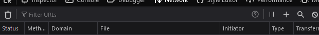

# QCS FIXR Scraper

# Before starting

I’d recommend at least a basic understanding of JavaScript and Node.JS

# Installation and Configuration

You’ll need Node.JS installed, version 16.5.0 or higher. I’d recommend using something like `nvm-windows` or `nvm` to manage your installations

Clone the repo

```bash
git clone https://github.com/queenscomputingsociety/qcs-fixr-scraper
```

Install dependencies

```bash
npm install
```

**Important - At this point, you need to configure some options to allow the code to start**

### Google Cloud Configuration

This section is a touch more involved, and will require you to create a Google Cloud Platform (GCP) Billing Account. 

Don’t worry, the services we are using are completely free! 

Head to [https://console.cloud.google.com](https://console.cloud.google.com) and sign in, go through any setup / walkthrough

Next,

- In the top search bar, search for “APIs & Services” and open the page
- Create a service account:
    - Click “Enable APIs And Services” and enable the “Google Sheets API”
    - Go back to APIs & Services, then click “Credentials”
    - Click “Create Credentials” then “Service Account”. This is what the bot will use to authorise itself with GCP
    - Give it a name, and then click “Done”
    - Click the newly created account, then go to “Keys”, “Add Key” and then “Create New Key”. Copy the downloaded JSON file to the bot’s directory, placing it in the root and renaming it to `google-credentials.json` (or paste its contents into the existing `google-credentials.json`).  **THIS FILE CONTAINS SENSITIVE INFO THAT CAN BE USED TO ACCESS YOUR GCP ACCOUNT. DO NOT UPLOAD IT TO GITHUB OR ANY OTHER SOURCE CONTROL**
    - Make a note of the service account’s principal name (can be found under the “details” tab. You will need this for the next step

### Google Sheets configuration

This bit is easy, you’re just making and sharing a sheet!

- Head to [`https://sheets.google.com`](https://sheets.google.com) and create a new sheet
- Click on “Share” in the top right corner, and paste in the service account email address from above
- Click “Send”
- Make a note of the sheet ID. This can be found in the URL of the sheet:
    - `https://docs.google.com/spreadsheets/d/XXXXXXXXXXXXXXXXXXXXXXXXXXXXXX`

### `config.js` configuration

This file contains the data the scraper needs in order to properly connect and authenticate, and it’s fairly self-explanatory. **This file contains sensitive data. Do not check it into source control.** 

- `email`
    - Your FIXR account email
- `password`
    - Your FIXR account password
- `eventId`
    - The event ID of the FIXR event you want to scrape. This can be found in the URL of both the customer-facing page and the organiser page:
        - Organiser:  `https://organiser.fixr.co/events/XXXXXXX`
        - Customer-facing: `https://fixr.co/event/XXXXXXX`
- `accountId`
    - The ID of your FIXR account. This is a pain to find.
        - Head to [`https://organiser.fixr.co`](https://organiser.fixr.co) and log in to your dashboard.
        - Open the developer tools by pressing `Ctrl-Shift-I` and go to the `Network` tab
        - Reload the page (Either by using F5 or going and pressing the reload button in your browser)
        - At the top of the Network tab there is a search box where you can filter URLs, type the following in 
        [`https://api.fixr.co/api/v2/reps/organiser/accounts`](https://api.fixr.co/api/v2/reps/organiser/accounts)
        
        
        
        - There should now only be a few requests, your account ID is the number shown in the “File” column (see image)
            
            
            
- `downloadDir`
    - The directory where the scraper will save files. This is defaulted to be “download”. Please don’t use an existing folder name, as the system is configured to wipe this folder on boot.
- `maxAttendees`
    - The highest amount of attendees at the event. 10000 should be enough for most. Changing this won’t have any impact on performance, the scraper just won’t retrieve any attendees past this point
- `sheetId`
    - The ID of the Google Sheet you want to target. Right now, this needs to be a publicly accessible sheet.
    - This can be found in the URL of the sheet:
        - `https://docs.google.com/spreadsheets/d/XXXXXXXXXXXXXXXXXXXXXXXXXXXXXX`
- `runEvery`
    - This sets the interval that the script runs, in hours. e.g.
        - For every hour: `1`
        - For every day: `24`
        - For every week: `168`

### Running

That’s it, after the configuration you should be able to open a terminal in the directory and use the following command to start it

```bash
node src
```

All being well, you’ll see a bunch of messages come up and the system run!

The script configures itself to run every `runEvery` hours, this defaults to 1. This is done using `node-schedule` for easy use with a daemon tool like PM2. 

### PM2 Setup

Running using node is great, but it provides no auto-restarting, file watching or anything else. For production, I’d recommend PM2. It allows you to daemonize applications and monitor logs. It can also support load balancing, which depending on your application, could be important

Install PM2 with the below command

```bash
npm install -g pm2
```

Run the app using PM2 with the below command (this enables filesystem watching, starts 4 load-balanced instances and gives it a friendly name

```bash
pm2 start src --name qcs-fixr -i 4 --watch
```

Enable PM2 at startup

```bash
pm2 startup
```

And finally, save the current state of processes, as this will be used to start services when the server reboots

```bash
pm2 save
```

## Fixing issues

If there are big issues with the web scraping, FIXR have likely updated their UI and the code can’t find the buttons anymore. The project will be updated as and when we find out about these changes.  You can however pass `false` instead of `true` to the `scrape()` function, which will tell Puppeteer to show the chromium window and will allow you to see what is happening. 

## Disclaimer

This code will only be updated as needed for feature, security and performance reasons, and should not be considered to be actively maintained.

QCS, or the Queen’s Computing Society, is a Society of Queen’s University Belfast (QUB) 

This code is provided as-is, with no warranty and the Queen’s Computing Society, QUB or any associated party accepts no responsibility or liability for any and all damages, costs or other consequences that arise from using this application, its code or any other associated assets